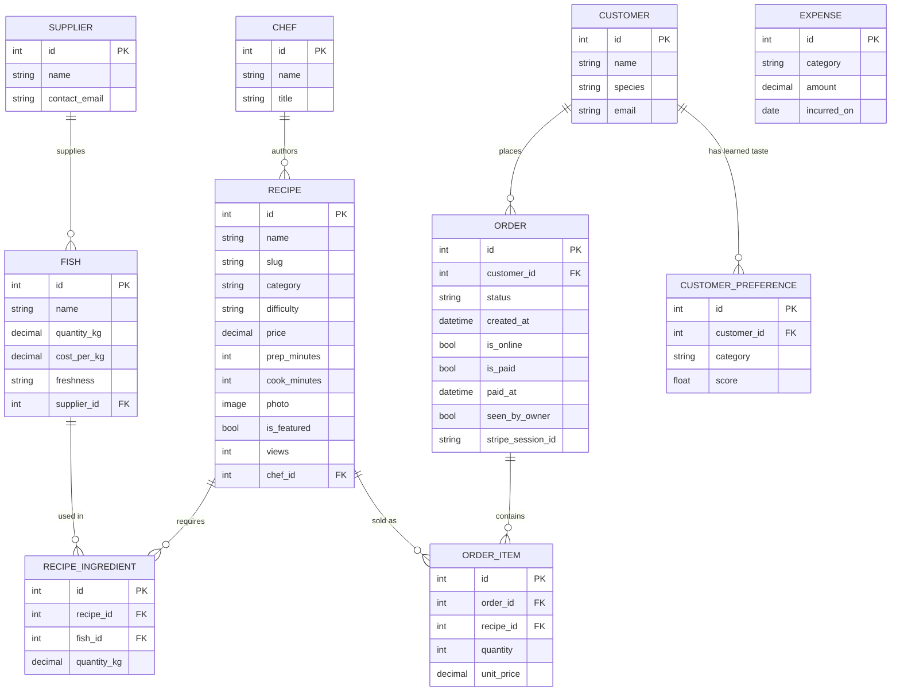

# PenguEats — Database Design (ERD)

Render this diagram at https://mermaid.live or in any Mermaid-capable viewer.

## Relationship summary
- **Supplier → Fish** (1-to-many): each supplier provides many fish types.
- **Fish ↔ Recipe** (many-to-many via **RecipeIngredient**): the association table
  carries the *quantity in kg* each recipe needs — this is the link between the
  menu and the inventory, and it powers the "cook right now" suggestions.
- **Chef → Recipe** (1-to-many).
- **Customer → Order → OrderItem ← Recipe**: a classic order-lines model. The
  unit price is snapshotted on each OrderItem so historical totals never change.
  Web orders carry payment state on **Order** (`is_online`, `is_paid`, `paid_at`,
  `seen_by_owner`, `stripe_session_id`): an online order only counts as revenue
  and deducts inventory once `is_paid` is true, and clearing `seen_by_owner`
  drives the dashboard's new-order notification.
- **Customer ↔ Recipe.category via CustomerPreference**: a learned taste score
  that grows every time the customer orders from a category.
- **Expense** stands alone and feeds the profit calculation
  (`profit = revenue − expenses`).

> Notes: the diagram shows each table's principal columns; a few purely
> descriptive fields (e.g. `Supplier.notes`, `Chef.bio`, `Recipe.instructions`)
> are omitted for readability. Freshness-based **dynamic pricing**
> (`current_price`, `discount_pct`) is *computed* from the least-fresh linked
> fish at read time — it is not a stored column, so it doesn't appear in the
> schema.
