# PenguEats — Pingu's Fish Restaurant Platform 
[Live App](https://pingu.up.railway.app/)

### Admin Login
Username: pingu
Password: School2026


A full-stack **Django 5** web application built for the *DLBFTPPP01 — Project
Programming with Python* oral project report. Pingu the penguin runs a fish
restaurant and uses Python to manage inventory, take orders, track profit,
suggest recipes from what's in stock, and learn each customer's taste.

The UI is styled with (orange + white, rounded cards) and
is **fully responsive** — it reflows cleanly from desktop down to mobile. Public
pages: Home, Recipes (with **live search**), Recipe detail, Menu, About, Blog and
Contact. Customers can browse, **search dishes**, add them to a **session cart**
and check out online; Pingu manages everything from a private owner dashboard.

## Screenshots

### Database schema / ERD diagram
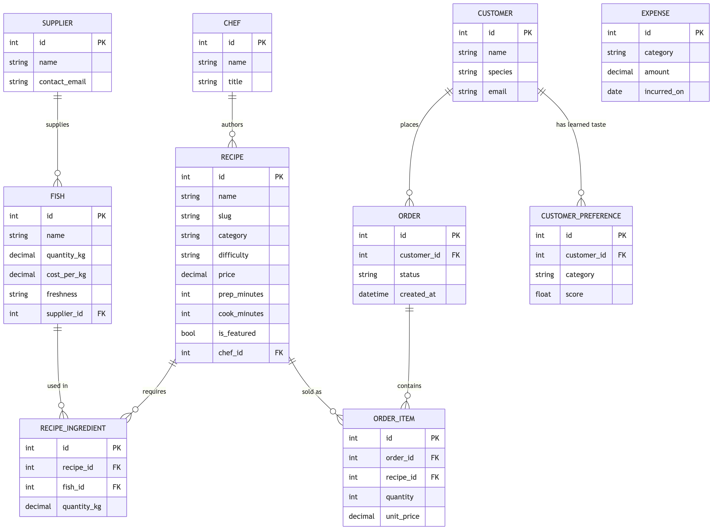

### Home (hero + featured dish)
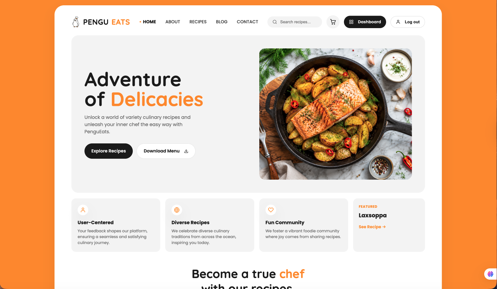

### Recipes + live search
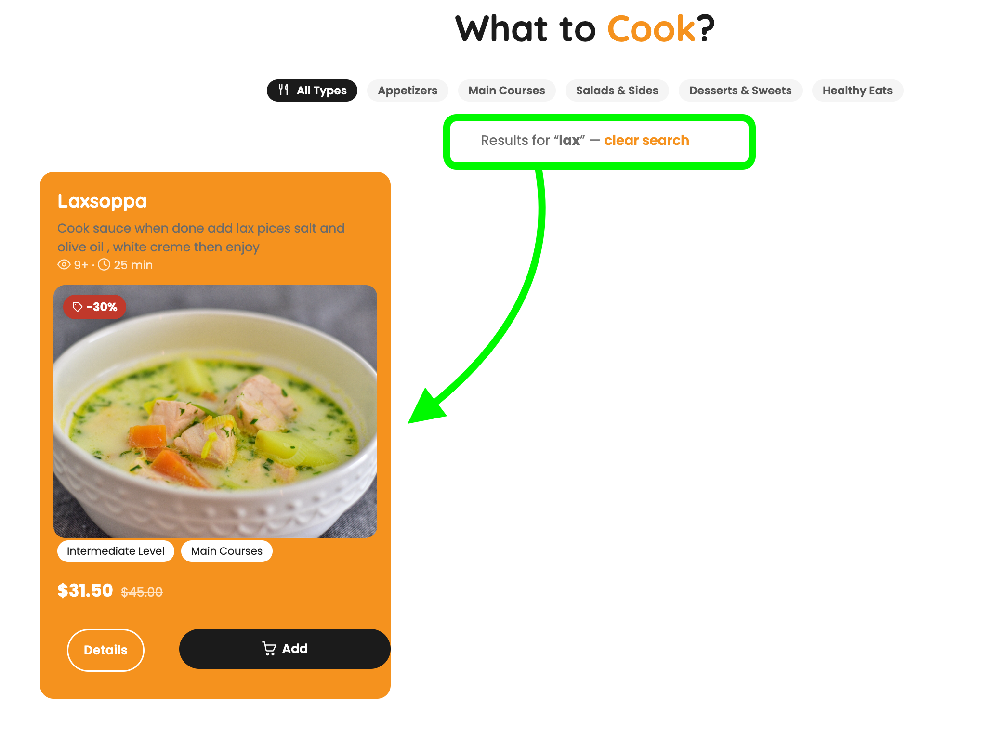

### Recipe detail
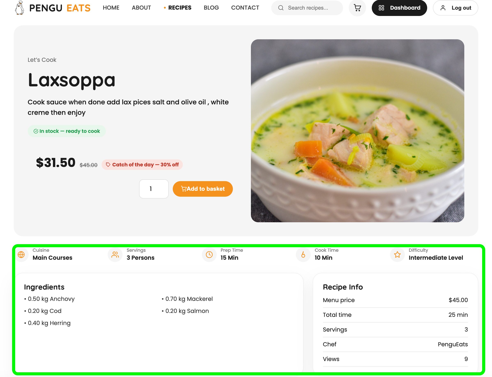

### Menu (printable price list)
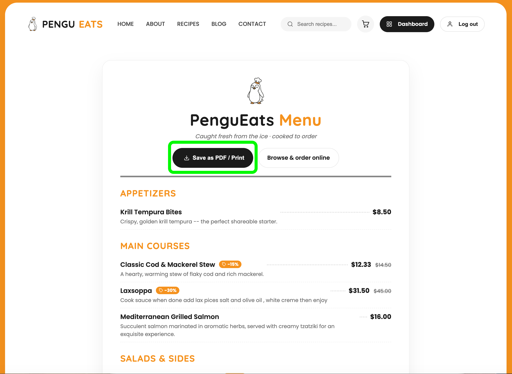

### Cart + checkout
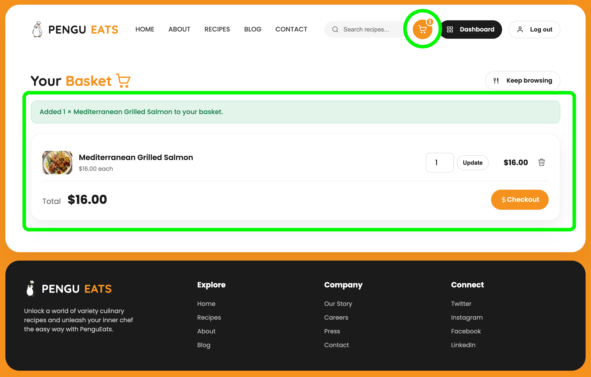

### Contact page
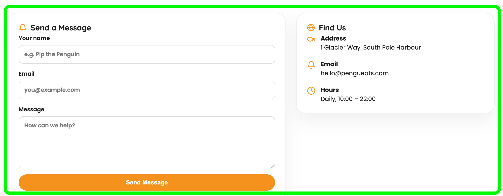

### Owner login
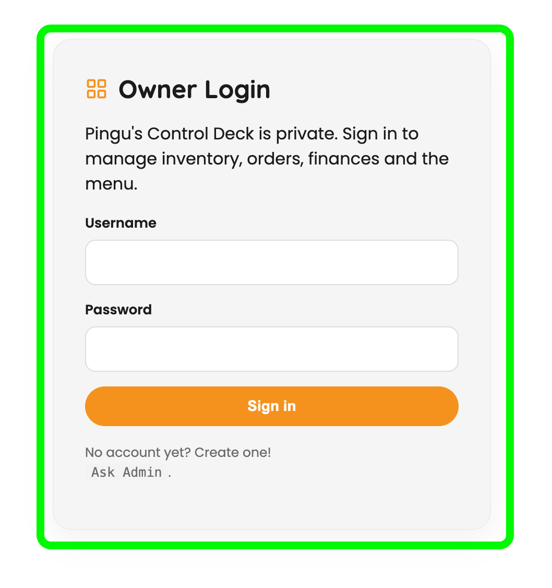

### Owner dashboard (inventory / orders / finance)
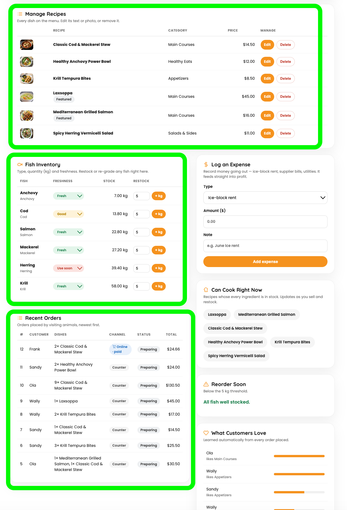

### Add / edit a recipe (CRUD)
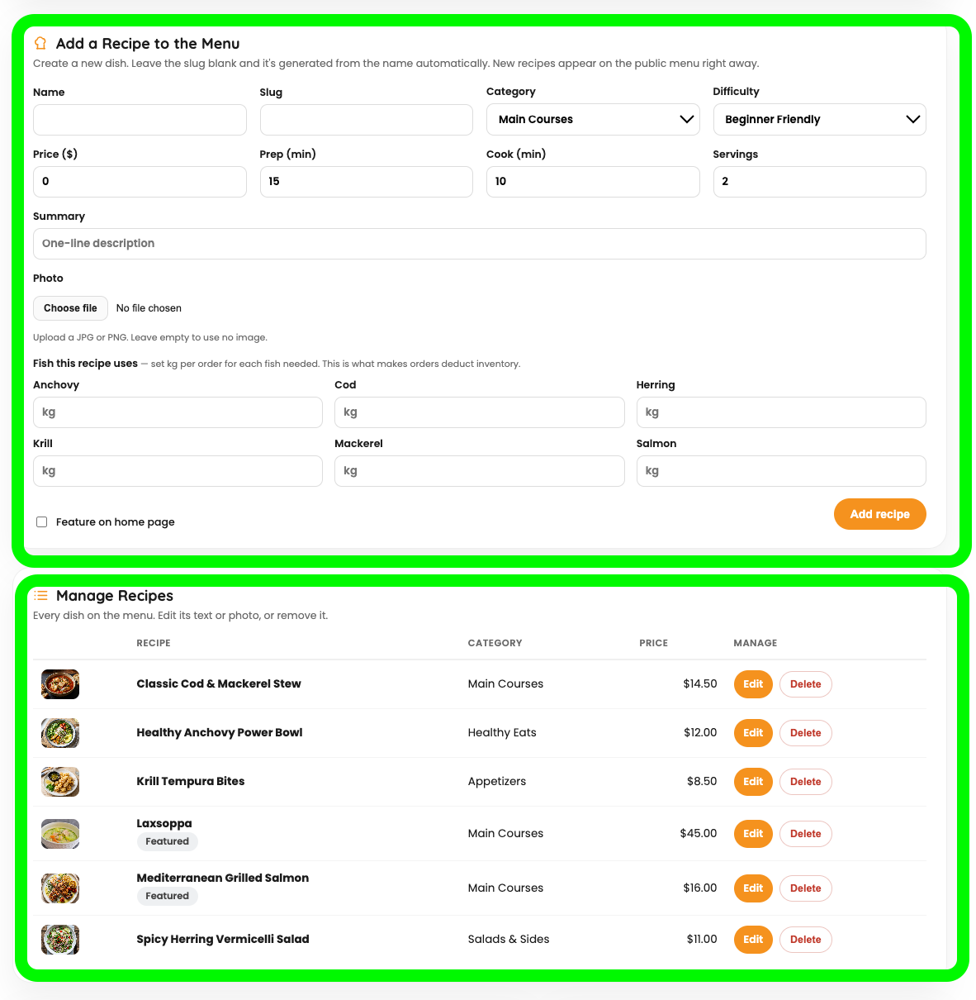

### Mobile / responsive view
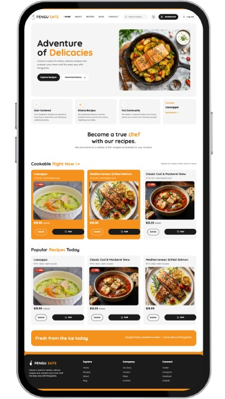

### Unit tests passing (`manage.py test`)
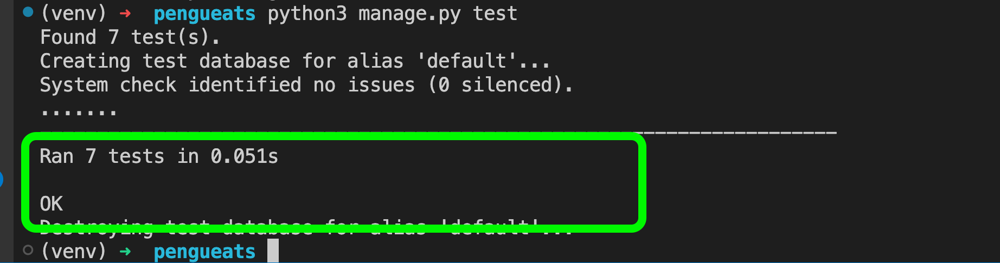

## Quick start

**1. Create and activate a virtual environment first** (keeps packages local to
the project instead of installing system-wide — standard Python practice):

```bash
# macOS / Linux
python3 -m venv venv
source venv/bin/activate

# Windows (PowerShell)
python -m venv venv
venv\Scripts\Activate.ps1
```
Your prompt shows `(venv)` once it's active. Type `deactivate` when finished.

**2. Install dependencies and run:**
```bash
pip install -r requirements.txt
python manage.py migrate        # build the SQLite database
python manage.py seed_data      # load realistic demo data
python manage.py runserver      # visit http://127.0.0.1:8000
```

> Shortcut (macOS/Linux): `bash run.sh` does all of the above in one command —
> creates the venv, installs, migrates, seeds, and starts the server.
**3. Create an owner login.** The dashboard (`/dashboard/`) is private — visiting
it while logged out redirects you to `/login/`. Create an account, then sign in:
```bash
python manage.py createsuperuser   # set a username + password
```
Now sign in at `http://127.0.0.1:8000/login/` use Username: pingu and Password: School2026 as admin to reach Pingu's Control Deck
(inventory, orders, finances, recipe suggestions, customer tastes) and to
**add new recipes to the menu** from the "Add a Recipe" panel. The same account
also works for Django's built-in admin at `/admin/`. The "Add a Recipe" panel
lets you **add a dish with a photo**, and the "Manage Recipes" list lets you
**edit** any recipe's text or image or **delete** it — full CRUD. Uploaded
images are stored under `media/` (handled by Pillow) while seeded recipes fall
back to bundled static images automatically. Recipes that already appear on
past orders are protected from deletion so sales history stays intact.

Run the test suite:
```bash
python3 manage.py test
```

Expected output — **7 passing unit tests** of the core business rules:
```text
Creating test database for alias 'default'...
System check identified no issues (0 silenced).
.......
----------------------------------------------------------------------
Ran 7 tests in 0.050s

OK
Destroying test database for alias 'default'...
```

These are **unit tests** (Django's `TestCase`, which wraps each test in its own
rolled-back database transaction). They live in `restaurant/tests.py` and cover
the business logic in `services.py`:

| # | Test | What it proves |
|---|------|----------------|
| 1 | `test_suggestions_only_include_in_stock_recipes` | The suggestion engine only returns recipes whose fish are in stock. |
| 2 | `test_place_order_deducts_inventory` | Placing an order correctly subtracts the fish used from inventory. |
| 3 | `test_place_order_records_revenue_and_learns_taste` | An order adds revenue **and** raises the customer's learned preference score. |
| 4 | `test_order_beyond_stock_is_rejected_and_rolled_back` | An impossible order raises `OutOfStockError` and the `@transaction.atomic` **rollback** leaves inventory untouched (atomicity). |
| 5 | `test_financial_summary_subtracts_expenses` | Profit = revenue − expenses is computed correctly. |
| 6 | `test_freshness_markdown_reduces_price` | Freshness-based dynamic pricing marks a dish down (Good −15%, Use-soon −30%). |
| 7 | `test_online_order_only_counts_and_deducts_once_paid` | A web order is invisible to revenue/inventory until paid, and `finalize_paid_order` is **idempotent** (no double-deduct). |


## What maps to the task brief
| Brief requirement              | Where it lives                                            |
|--------------------------------|-----------------------------------------------------------|
| Manage inventory               | `Fish` model + `services.restock_fish`, `low_stock_report`|
| Handle customer orders         | `Order`/`OrderItem` + `services.place_order` (atomic)     |
| Track profits & expenses       | `Expense` model + `services.financial_summary`            |
| Suggest recipes from stock     | `Recipe.can_be_made` + `services.suggest_recipes_in_stock`|
| Learn customer preferences     | `CustomerPreference` + `services.learn_preference`        |
| Owner-only dashboard (login)   | `@login_required` + `LoginView` + `restaurant/login.html` |
| Recipe CRUD (add/edit/delete)  | `RecipeForm` + `create/edit/delete_recipe_view`           |
| Upload / replace a recipe photo| `Recipe.photo` (ImageField/Pillow) + `MEDIA_*` settings   |
| Online cart & checkout         | `cart.py` (session cart) + `payments.py` + `checkout` views|
| Freshness-based dynamic pricing| `Recipe.current_price` / `discount_pct` (computed)        |
| Search the menu                | `recipe_list` view + `Q` lookups (name/description)       |
| Contact form                   | `contact` view + `restaurant/contact.html`                |
| Responsive (mobile) UI         | CSS media queries + table→card stacking in `style.css`    |
| Stakeholder presentation       | `PenguEats_OralProjectReport.pptx` + speaker sheet        |

## Project layout
```
pengueats/
├── manage.py
├── requirements.txt
├── run.sh                  # one-command setup + run
├── ERD.md                  # database design diagram
├── pengueats/              # project settings, root URLs, wsgi/asgi
└── restaurant/             # the application
    ├── models.py           # the 10 database tables (well commented)
    ├── services.py         # ALL business logic (the part to demo!)
    ├── cart.py             # session-based shopping cart helpers
    ├── payments.py         # checkout / payment simulation
    ├── forms.py            # RecipeForm (ModelForm) for adding menu items
    ├── views.py            # thin views -> templates (dashboard is login-gated)
    ├── admin.py            # back-office dashboard
    ├── tests.py            # unit tests of the business rules
    ├── api/                # JSON REST API (DRF)
    ├── management/commands/seed_data.py
    ├── templates/restaurant/   # public pages + owner dashboard
    └── static/restaurant/      # CSS + images
docs/screenshots/           # <- put your README screenshots here
```

## Architecture highlights (good practices)
- **Separation of concerns**: business rules live in `services.py`, not in views.
- **Atomic transactions**: `place_order` is all-or-nothing, so inventory never
  ends up half-updated even if an order fails.
- **DecimalField for money/weight** to avoid floating-point rounding errors.
- **Computed properties** (`Order.total`, `FinancialSummary.profit`) so totals
  can never drift out of sync with their parts.
- **Tested**: `python manage.py test` proves the core rules.
- **Easy to re-theme**: all colours are CSS variables at the top of `style.css`.
- **Search via `Q` objects**: the navbar search builds an OR query
  (`Q(name__icontains=q) | Q(description__icontains=q)`) instead of raw SQL — safe
  from injection and database-agnostic.
- **Session-based cart**: the basket lives in the Django session, so customers
  don't need an account to shop; the order is only written to the database on a
  successful checkout.
- **Mobile-first responsiveness**: wide data tables collapse into labelled cards
  on small screens using `data-label` attributes + CSS `::before`, so nothing
  overflows on a phone.

  
